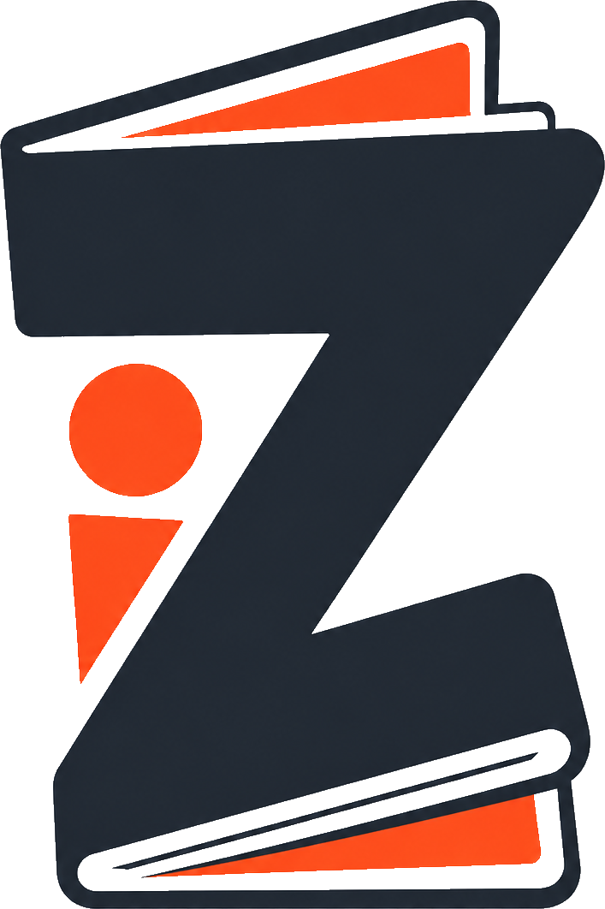

  

<h1 align="center">Zineit by Storitellah</h1>

  Make print-ready zines and photobooks — right in your browser, all on your device.

  <a href="https://zineit.app"><b>Open ZineIt →</b></a>

---

**ZineIt** is a free, local-first layout tool for photographers and photojournalists. Drop
in your photos, arrange them, and export something you can actually print — a folded mini-
zine, a saddle-stitched booklet, or a photobook.

It's one HTML file. No account, no upload, no cloud. Your photos never leave your computer,
and your originals are never touched.

### What it does

- 📐 **Real formats** — A4 mini-zines, photobooks and saddle-stitch booklets, with fold and
  cut guides that line up.
- 🖼️ **Photos, never stretched** — frames crop; your pictures always keep their true shape.
- 📄 **One-click A4 PDF** — export a 300 DPI, print-ready mini-zine, named after your project.
- 🎨 **Panoramas** — run one photo across a spread, several pages, or the whole cover.
- 📖 **Flipbook reader** — page through your zine like a real book before you print.
- 🖌️ **Transparent graphics** — drop in logos and QR codes with no white box.
- 🔒 **Yours, offline** — works from a file, on a plane, forever. Backs up to a small file
  you keep.
- 📱 **Phone & tablet ready** — the whole thing works on mobile browsers too.

### Printing well

ZineIt exports clean 300 DPI, correctly-sized, bleed-ready files. For CMYK with a specific
ICC profile (Coated GRACoL 2006 / FOGRA39), open the export in a prepress tool like Affinity
Publisher, Scribus (free) or Acrobat and convert there — the Print & colour panel explains
how, including standard vs rich black and bleed.

### Run it

Just open [zineit.app](https://zineit.app), or download `index.html` and open it in any
browser. That's it.

There's also a **Lightroom plugin** (`lightroom/`) and an **Android project** (`android/`)
for building the app — see [`docs/`](docs/) for guides on hosting, the mini-zine format,
templates, and building the APK.

---

  Built by <a href="https://storitellah.com">Storitellah</a> · questions? <a href="mailto:hello@storitellah.com">hello@storitellah.com</a>

